# 🔐 Cyber Security Toolkit

## Live Demo

The application is deployed on Render: [Cyber Security Toolkit](https://cyber-security-toolkit-40ub.onrender.com)

> The free Render service may take up to a minute to start after inactivity.

## Render deployment

Render can host the complete Streamlit interface. The included `render.yaml` installs the Python dependencies and starts `app.py` with Render's assigned port. In the Render dashboard, select **New +** → **Blueprint**, connect this repository, and deploy the detected Blueprint.

The default Render filesystem is ephemeral: files, encryption keys, and password-manager data may be lost after a restart or redeploy. Packet capture also requires privileges normally unavailable to hosted containers. Do not use the public deployment to scan targets unless you own them or have explicit authorization.

A Python-based Cyber Security Toolkit that provides multiple security utilities in one application. This project is designed for students and beginners to learn cybersecurity concepts through practical tools.

---

## 📌 Features

- Password Strength Checker
- SHA-256 Text Hash Generator
- SHA-256 File Hash Generator
- File Comparison using Hashes
- DNS Lookup
- Port Scanner
- Log Analyzer
- Website Security Scanner
- Packet Sniffer
- Password Manager (Encrypted)
- Vulnerability Scanner
- File Encryption & Decryption

---

## 🛠 Technologies Used

- Python 3
- Requests
- Scapy
- Cryptography
- Socket Programming
- JSON

---

## 📂 Project Structure

```text
cybersecurity-toolkit/
│
├── main.py
├── password_checker.py
├── hash_generator.py
├── dns_lookup.py
├── port_scanner.py
├── log_analyzer.py
├── website_scanner.py
├── packet_sniffer.py
├── password_manager.py
├── vulnerability_scanner.py
├── file_encryption.py
├── activity_logger.py
├── requirements.txt
│
├── data/
├── encrypted/
├── files/
├── keys/
├── logs/
└── reports/
```

## ⚙️ Installation

Clone the repository:

```bash
git clone <repository-url>
```

Move into the project folder:

```bash
cd cybersecurity-toolkit
```

Install dependencies:

```bash
pip install -r requirements.txt
```

Run the application:

```bash
python main.py
```

---

## 📸 Sample Output

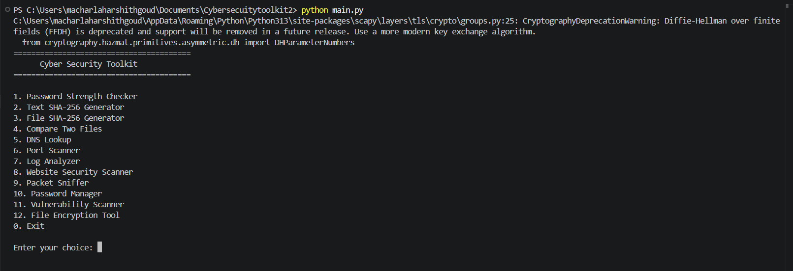

### Password Strength Checker

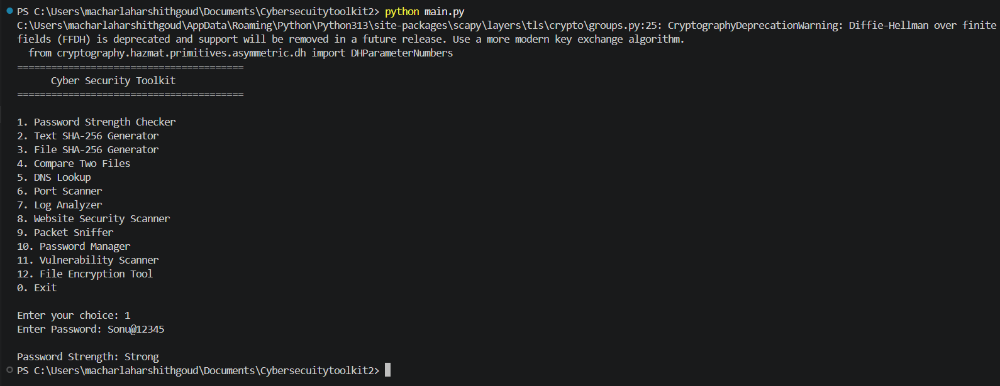

### SHA-256 Hash Generator

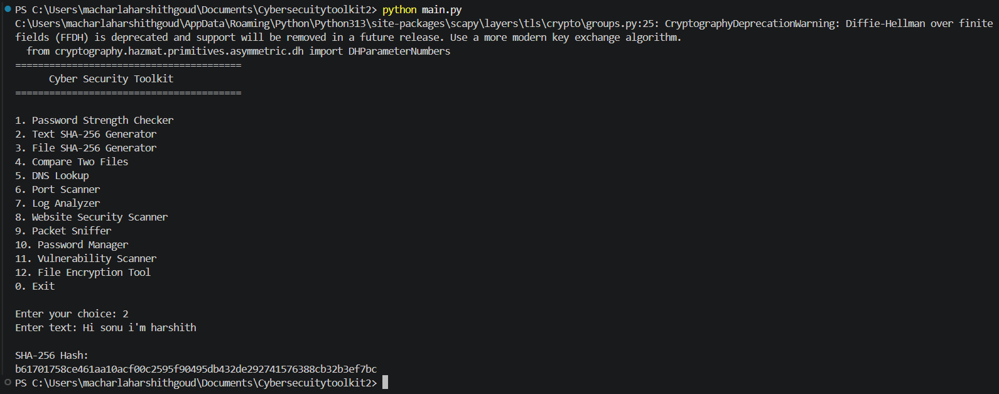

### File Hash Generator

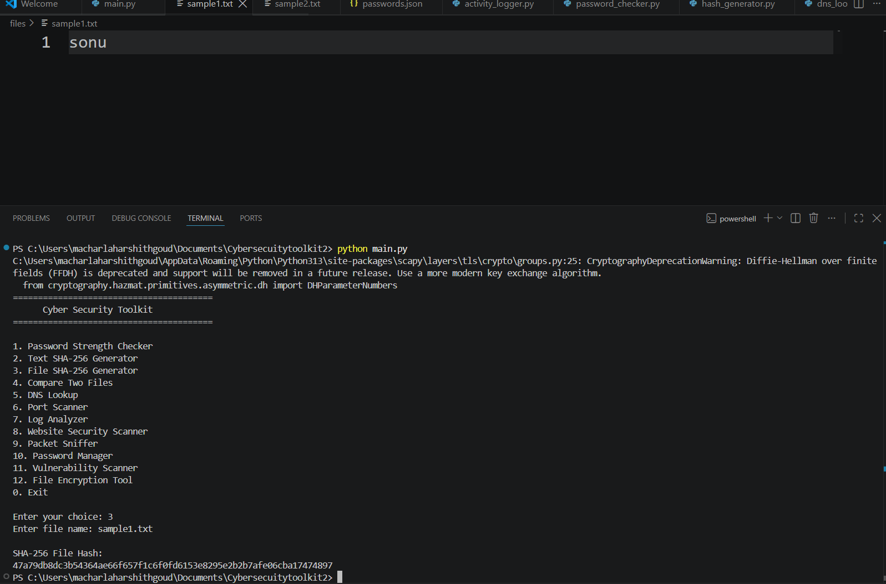

### File Comparison

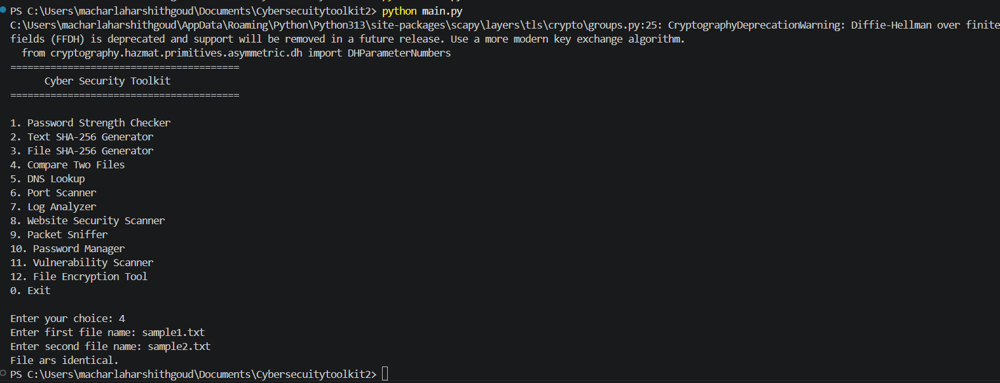

### DNS Lookup

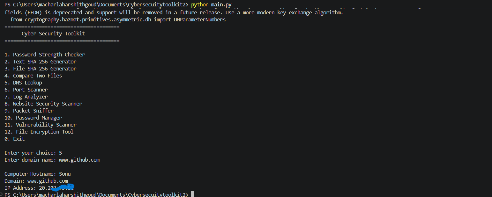

### Port Scanner

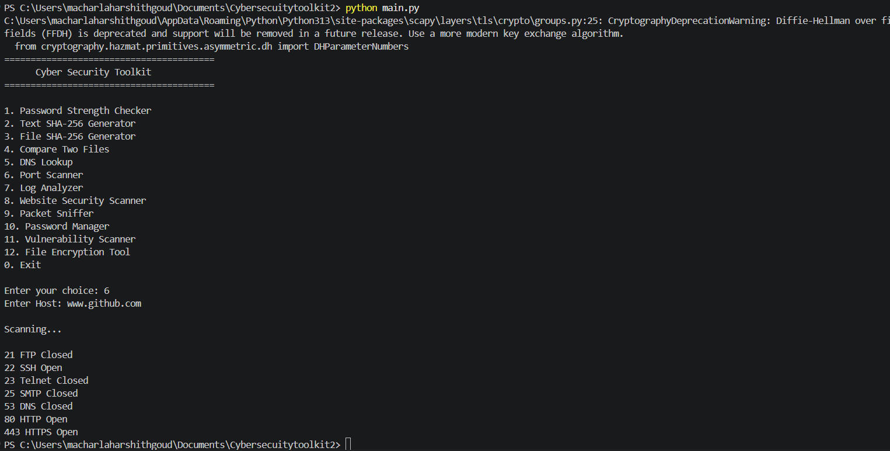

### Log Analyzer

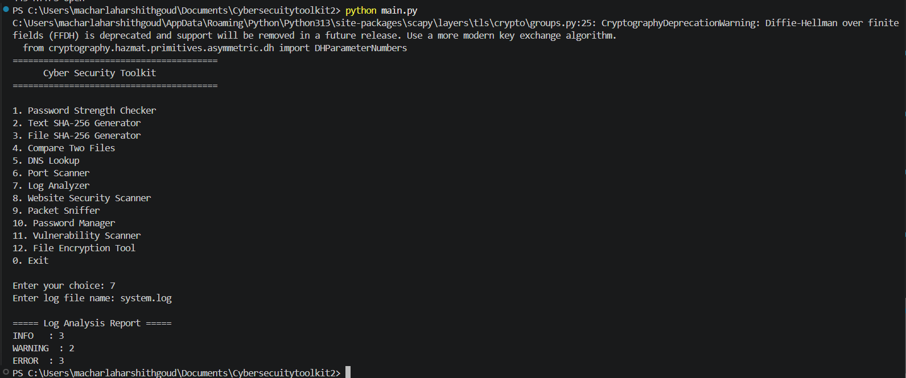

### Website Security Scanner

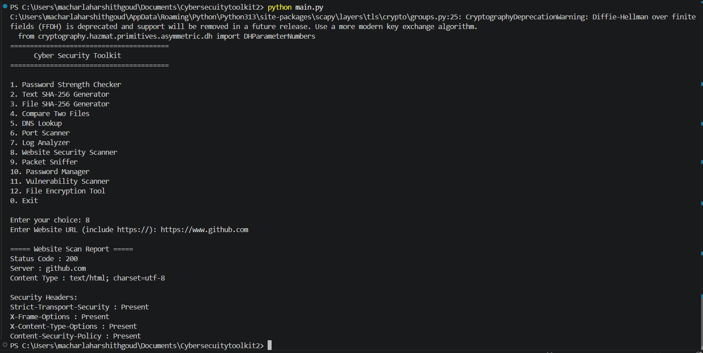

### Packet Sniffer

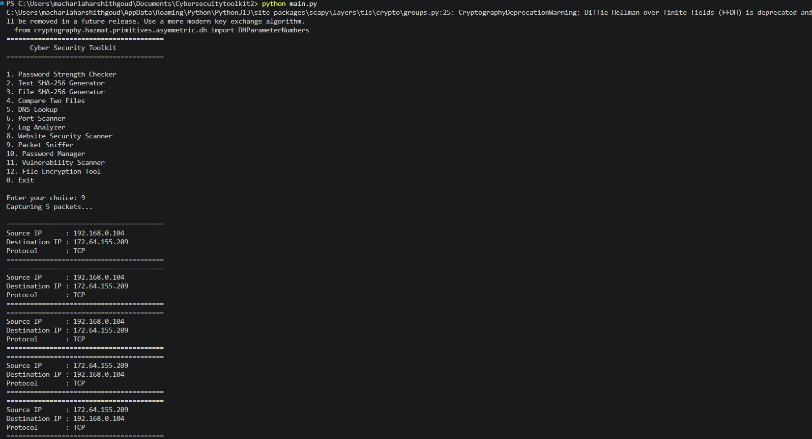

### Password Manager

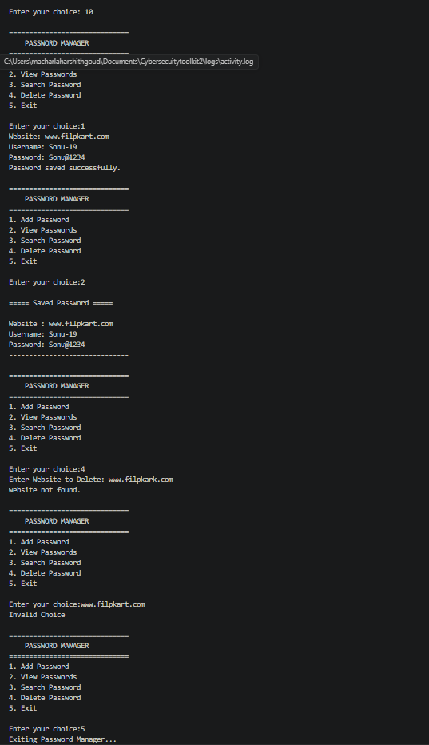

### Vulnerability Scanner

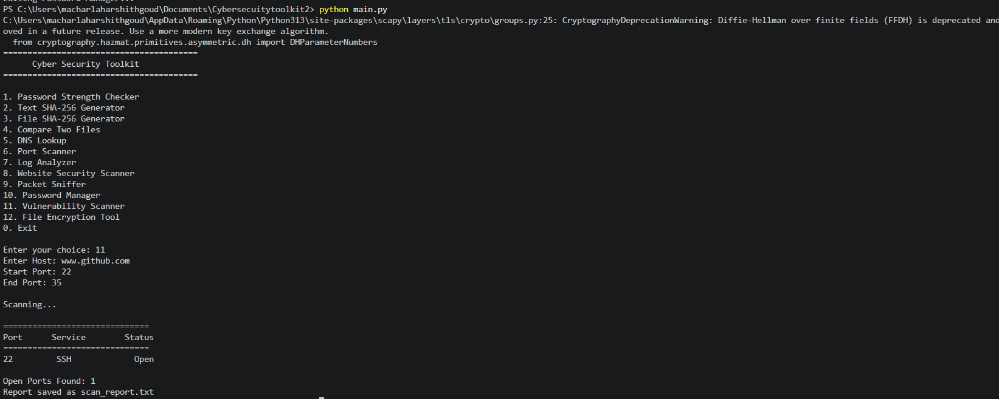

### File Encryption Tool

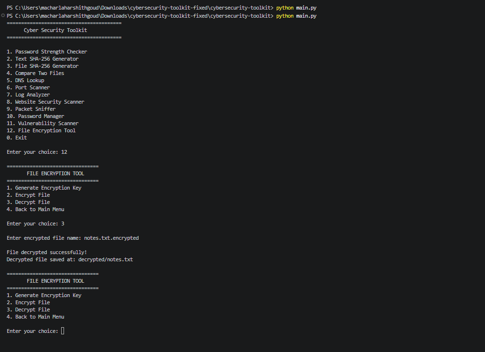

---

## 📈 Future Improvements

- GUI using Tkinter or PyQt
- Network Scanner
- Whois Lookup
- IP Geolocation
- Malware Hash Lookup
- PDF Report Generation
- Multi-threaded Port Scanner
- Login Authentication
- Export Reports to CSV

---

## 👨‍💻 Author

**Macharla Harshith Goud**

Cyber Security Enthusiast | Python Developer | CSE Student

---

## 📄 License

This project is licensed under the MIT License.
